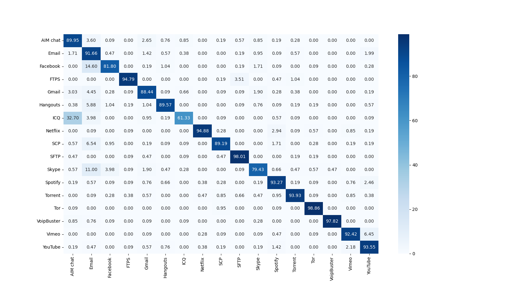
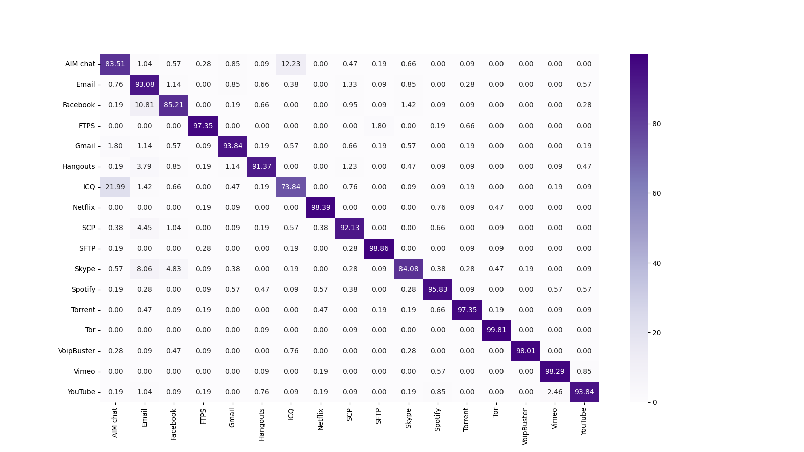

Encrypted Traffic Classification with SAE and CNN
==
[](#)
[](https://www.python.org/downloads/release/python-3117/)
[](https://flake8.pycqa.org/en/latest/)
[](https://black.readthedocs.io/en/stable/)
[](https://code.visualstudio.com/)

Overview
--
Encrypted traffic classification model based on SAE(Stacked AutoEncoder) and CNN(Convolutional Neural Network)\
This repository implements SAE and CNN model from [Lotfollahi et al.(2020)](https://link.springer.com/article/10.1007/s00500-019-04030-2), and ensemble model with two models mentioned. \
Python file `src/preproc/packet.py` partially referenced [code](https://github.com/munhouiani/Deep-Packet/blob/master/preprocessing.py) by [munhouiani](https://github.com/munhouiani).

Requirements
--
### Python
`3.10` or `3.11` (PyTorch not available in Python `3.12`)
### Packages
Joblib, Matplotlib, NumPy, pandas, PyTorch, PyTorch Lightning, regex-spm, Scapy, scikit-learn, seaborn
```bash
pip install numpy pandas joblib scapy regex_spm torch pytorch_lightning scikit-learn matplotlib seaborn
```
### Dataset
ISCX VPN-nonVPN(ISCXVPN2016) Dataset from CIC(Canadian Institute for Cybersecurity)\
[Link](https://www.unb.ca/cic/datasets/vpn.html)

Tested Environment
--
### Hardware
- **CPU**: Intel® Xeon® Gold 6230R @ 2.10GHz (26 Cores, 52 Threads) × 2
- **GPU**: NVIDIA GeForce RTX 3090 (VRAM 24 GB) × 9
- **RAM**: 320 GB

### Software
- Ubuntu 20.04.1
- CUDA 12.2
- Python 3.11.3
- PyTorch 2.0.1
- PyTorch Lightning 2.0.4

Usage
--
1. Download the dataset and copy all `.pcap` files to `data/raw`
2. `python src/preprocess.py`
3. `python src/undersample.py`
4. `python src/split_sample.py`
5. Train models (i.e. `python src/train_app_sae.py`)\
    (Ensemble models require both trained SAE and CNN model for each task. )\
    (Run TensorBoard if you need. )
6. Test models (i.e. `python src/test_app_sae.py`)

Results
--
1. Application Identification with SAE

2. Application Identification with CNN

3. Application Identification with Ensemble(SAE+CNN)

4. Traffic Characterization with SAE

5. Traffic Characterization with CNN

6. Traffci Characterization with Ensemble(SAE+CNN)
